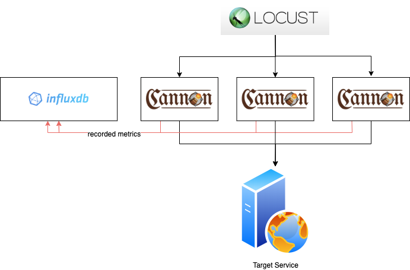

# Zalopay Cannon v0.1.1

 []() []()


## Introduction

ZaloPay Cannon is a benchmark system for ZaloPay's internal service. The aim is to build a multi-tennant system which provides intuitive UI/UX for users to submit tasks and perform benchmark.  

## Architecture

  

## Features

- Benchmark gRPC service with given proto.  
- Distributed testing: run tests on multiple slaves.  
- Automatically generate input data.  
- Visualize data: metrics data is stored and visualized using InfluxDB.  
- Only support Unary RPCs.  

## Requirements

- Golang 1.13.1
- Locust
- Influxdb 2.0
- Python 3.7.3  

## Configuration

### Cannon Config

```yaml
# Locust Config
LocustWebPort: "http://0.0.0.0:7000/"
LocustHost: "127.0.0.1"
LocustPort: 5557
NoWorkers: 80 # Number of connections
HatchRate: 10 # Hatch rate

# InfluxDB Config
IsPersistent: "true" # turn on if you want save metrics in influxDB
Bucket: "benchmark-results" # InfluxDB bucket's name
Origin: "zlp-osss"
DatabaseAddr: "http://0.0.0.0:9999"
Token: "egc6_K6V0pCmEwIahIzmnoneommTcsa7TS5XtmcSBnR9VeX31dMsRJ_STN-bUqOwWW77vPiU0aM9RGMQFwxT-A=="

# gRPC benchmark target
GRPCHost: "localhost"
GRPCPort: 4770
Proto: "./proto-name.proto"
Method: "serviceName.methodName"
```

## Usage

- Make sure Locust, InfluxDB and gRPC server are running.

```bash
Usage:
  cannon run [flags]

Flags:
  -c, --config string   Config file (default "")
      --host string     Config target host (default "localhost")
      --port int        Config gRPC port (default 5557)
  -p, --proto string    Proto File (default "./ping.proto")
  -m, --method string   Method name (default "ping.PingService.ping")
  -r, --hatchRate int    config Hatch rate (users spawned/second) (default 10)
  -w, --no-workers int   Number of workers to simulate (default 800)
  -h, --help            help for run

```

## Example

Read the [example](example/README.md)

## Roadmap

Read the [roadmap](docs/ROADMAP.md)

## Acknowledgements

- Thanks to @anhld2, which served as an inspiration and guide in building this project.
- Special thanks to @thinhda, @tranndc and @quyenpt for their work on making component-based theming a reality.
