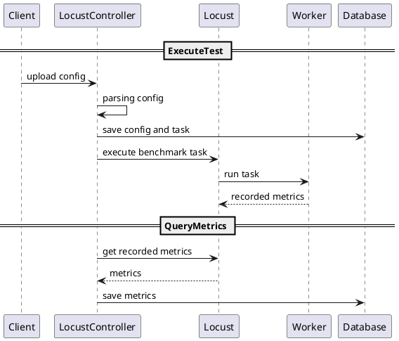

# Benchmark System

## Requirement

- Support load test as code
- Support simulate multiple protocol (gRPC, HTTP,...)
- Flexible configuration
- UI to client can: config task, submit task, view report
- Persistent data
  
## Specification

### Flowchart

## Planning

### Sprint 1 (v0.1.1)

Overview:

- Basic benchmark tool.
- CLI tool features:
  - Connect Locust and work as slave.
  - Auto generate data and request server by specific proto file.
  - Test configuration: hatch rate, concurrent user, target service.
  - Render report to LocustUI.

Deliveriable:

- Source code
- Documentations: sequence diagram , usecase, internal service, technical stack.

[Detail](src/README.md)

### Sprint 2

`TBD`