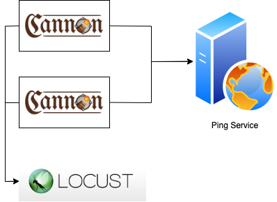
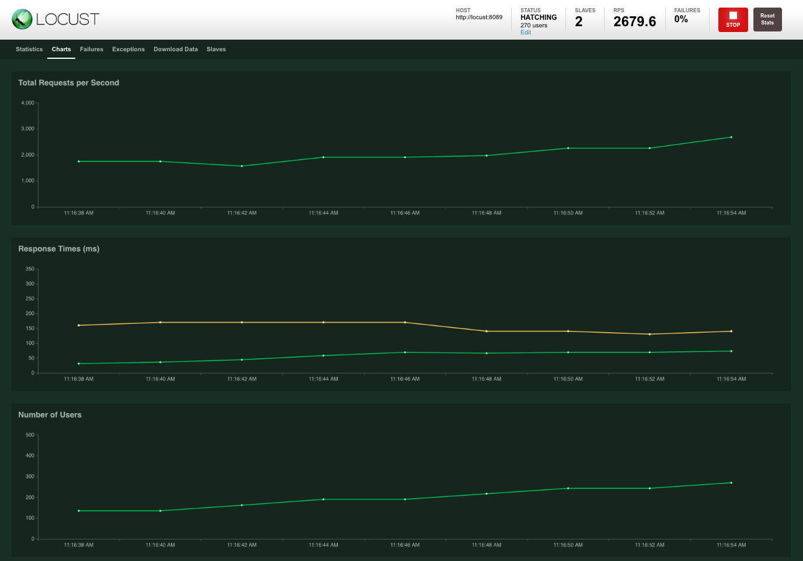

# Example

## Run with docker

Requirement (go to the next step, if you already have):

- [docker](https://docs.docker.com/install/)
- docker-compose

Deployment model:



Start test by command

```bash
$ cd example
$ docker-compose up
```

Access [localhost:8089](http://localhost:8089) to view report

