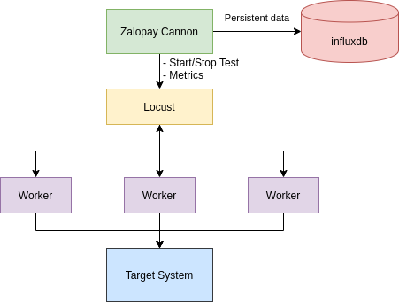

# Zalopay-Cannon v0.1.1

## Requirements

- Golang 1.13.1
- Locust
- Influxdb 2.0
- Python 3.7.3

## Features

- Benchmark gRPC service with given proto
- Only support Unary RPCs

## Architecture



## Configuration

### Cannon Config

```yaml
# Locust Config
LocustWebPort: "http://0.0.0.0:7000/"
LocustHost: "127.0.0.1"
LocustPort: 5557
NoWorkers: 80 # Number of connections
HatchRate: 10 # Hatch rate

# InfluxDB Config
Bucket: "benchmark-results" # Influx DB Bucket's name
Origin: "zlp-osss"
DatabaseAddr: "http://0.0.0.0:9999"
Token: "egc6_K6V0pCmEwIahIzmnoneommTcsa7TS5XtmcSBnR9VeX31dMsRJ_STN-bUqOwWW77vPiU0aM9RGMQFwxT-A=="

```

### Slave Config

```yaml
# Locust Config
LocustWebPort: "http://0.0.0.0:7000/"
LocustHost: "127.0.0.1"
LocustPort: 5557

# gRPC Config
GRPCPort: 4770
GRPCHost: "localhost"
Method: "serviceName.methodName"
Proto: "./proto-name.proto"
```

## Run

- Make sure Locust, InfluxDB and gRPC server are running.

### Run Slave

```bash
Usage:
  run [flags]

Flags:
  -c, --config string   Config file (default "./configs/default-slave-config.yaml")
  -h, --help            help for run
      --host string     Config gRPC host (default "localhost")
  -m, --method string   Method name (default "service.PingService.ping")
      --port int        Config gRPC port (default 5557)
  -p, --proto string    Proto File (default "./transaction.proto")
```

### Run Cannon

```bash
Usage:
  run [flags]

Flags:
  -c, --config string    Config file (default "./configs/default-cannon-config.yaml")
  -r, --hatchRate int    config Hatch rate (users spawned/second) (default 10)
  -h, --help             help for run
  -w, --no-workers int   Number of workers to simulate (default 800)
```

